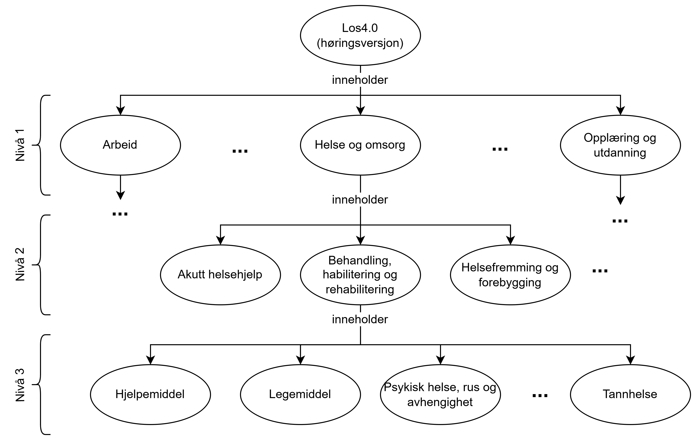

== Los-struktur og -innhold [[struktur-og-innhold]]

=== Hovedprinsipper lagt til grunn for Los-strukturen [[hovedprinsipper]]

__#@@@@@@ vurder å ta dette avsnitt ut til et eget kapittel sammen med ev. kriterier for utvidelse av Los#__

Los skal over tid være stabil og robust. Følgende hovedprinsipper ligger derfor til grunn for strukturen og innholdet i Los:

. Los skal inneholde *nøytrale temaer*, slik at de skal kunne brukes til å klassifisere ikke bare tjenester, men også ressurser som kan være data, applikasjoner osv. Los-temaer skal med andre ord være uavhengige av hvordan tjenester og ressurser er organisert og levert, uavhengige av løsninger og teknologier osv. Over tid vil Los dermed kunne inneholde *stabile temaer* som ikke vil kreve hyppige endringer.
** Eksempel: «Helse – barn og unge» er valgt som tema, og kan brukes på «skolehelsetjenesten», «helseundersøkelser hos barn og unge», «helseinformasjon rettet mot barn og unge» osv. 
. Los skal være *rent hierarkisk*. Dette betyr at hvert Los-tema skal bare finnes ett sted i Los-strukturen. Det er dessuten ikke en «type / subtype»-relasjon mellom nivåene i Los, men en «inneholder / inngår i»-relasjon, selv om det i noen tilfeller vil kunne tolkes som en «type / subtype»-relasjon. 
.. Plasseringen i strukturen er valgt ut fra hva det aktuelle temaet primært handler om, og uavhengig av hvor eventuelle tjenester er plassert/organisert. 
** Eksempel: temaet «Helse - barn og unge» finnes bare under «Helse og omsorg» | «Helsefremming og forebygging» som temaet primært handler om, og ikke også under «Opplæring og utdanning» selv om «skolehelsetjenesten» kan organiseres og tilbys i tilknytning til «Grunnskoleopplæring» og «Videregående skoleutdanning» som er temaer under «Opplæring og utdanning». 
. Los skal *ikke være en «ordbok»*. Dette betyr at Los 4.0 ikke kommer til å inneholde forklaring på temaene, men skal peke til relevante begreper/forklaringer som er tilgjengelige i begrepskataloger, regelverk, veiledere osv. 
. Hvert tema i Los skal ha en *unik og stabil identifikator* (persistent URI). Det er denne URI-en som skal brukes når temaet skal refereres/lenkes til. 
.. Los skal ha *innholdsløse URI-er*, hvilket betyr at URI-ene ikke skal inneholde ord og uttrykk fra naturlige språk. Dette for at URI-ene skal være stabile og ikke måtte endres dersom det skulle bli aktuelt å endre den anbefalte termen til et tema. 
** Eksempel: temaet «Helse - barn og unge» har URI-en `\https://id.norge.no/vocabulary/los/04019` (NB: dette er kun en illustrativ identifikator som ikke nødvendigvis er den endelige identifikatoren etter høringen).

=== Los-strukturen [[los-strukturen]]

:xrefstyle: short

[[img-los-struktur]]
.Illustrasjon av Los-struktur

Som illustrert i <>, har Los en trestruktur: 

*	*Los er temainndelt*. I høringsversjonen er det totalt 15 hovedtemaer (også kalt hovedgrener), f.eks. «Arbeidet», «Helse og omsorg», «Opplæring og utdanning» osv.
*	*Los er nivåinndelt*. I høringsversjonen er det 3 nivåer, f.eks. «Helse og omsorg» | «Helsefremming og forebygging» | «Helse – barn og unge». Jo lengre ned i trestrukturen man kommer, jo mer spesifikke blir temaene. 
*	Hver node i trestrukturen representerer ett Los-tema, f.eks. «Helse og omsorg». Som illustrert i <> er det en «inneholder»-relasjon mellom et gitt tema på et nivå og temaene på nivået/nivående under. F.eks. temaet «Helse og omsorg» inneholder temaene «Helsefremming og forebygging», «Behandling, habilitering og rehabilitering», «Pleie og omsorg» osv.; og temaet «Behandling, habilitering og rehabilitering» inneholder temaene «Hjelpemiddel», «Legemiddel», «Psykisk helse, rus og avhengighet», «Somatisk helse» og «Tannhelse». 
*	Siden Los ikke har et uendelig antall nivåer, kan temaer på det laveste nivå (nivå 3)  ha inklusjonsnoter i fritekst, f.eks. «Hjelpemiddel» har en inklusjonsnote «Inkluderer: behandlingshjelpemiddel, hjelpemiddel og tilrettelegging for person med funksjonsnedsetting …». Dette for at Los ikke skal ha et uendelig antall nivåer.

:xrefstyle: full

=== Los-innhold [[los-innhold]]

Hver node i Los-strukturen inneholder ett tema. 
Hvert tema kan ha bl.a. følgende egenskaper:

* En unik og stabil identifikator (*URI*) som skal brukes når man skal referere/lenke til temaet.
* En *Anbefalt term* på bokmål, nynorsk og engelsk som fortrinnsvis skal brukes når temaet omtales tekstlig.
* *Overordnede kategorier*: Kategorien(e) temaet inngår i (f.eks. er «Helse og omsorg» en overordnet kategori for «Behandling, habilitering og rehabilitering»).
* *Underordnede kategorier*: Kategorien(e) som temaet inneholder (f.eks. er «Hjelpemiddel» en underordnet kategori til «Behandling, habilitering og rehabilitering»).
* *Inklusjonsnoter, eksklusjonsnoter* i fritekst: Los-noder på laveste nivå kan ha inklusjonsnoter eller eksklusjonsnoter i fritekst, som forklarer hva som inngår i eller ikke inngår i det aktuelle temaet (f.eks. «Inkluderer: behandlingshjelpemiddel, hjelpemiddel og tilrettelegging for person med funksjonsnedsetting …» er en inklusjonsnote til temaet «Hjelpemiddel»).
* *Alternativ term* (også kalt synonym) på bokmål, nynorsk og engelsk som også kan brukes når temaet omtales tekstlig.
* *Hører til* som angir hvilket nivå i Los-strukturen temaet befinner seg på (f.eks. «Hjelpemiddel» hører til nivå 3).

Inklusjonsnoter, eksklusjonsnoter og alternative termer (synonymer) er ikke uttømmende. Det er derfor viktig å bruke den unike identifikatoren (URI-en) til å referere til et tema i Los, spesielt når man bruker andre synonymer enn det som er tatt med for temaet. Se også under <<Bidra-til-los>> for hvordan du kan bidra til å gjøre Los mer komplett.