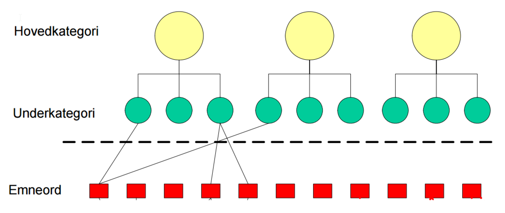

== Om Los

Los er en felles terminologi for å beskrive offentlige tjenester og ressurser. Vokabularet er brukerorientert, og kan brukes til å kategorisere for eksempel tjenester, informasjon, datasett og andre ressurser som offentlige virksomheter forvalter. Formålet med Los er å gjøre offentlige ressurser enklere å finne.

Los kan benyttes til en rekke formål, for eksempel:

 * søkeoptimalisering for beskrivelser av offentlige tjenester
 * flerspråklige beskrivelser av offentlige ressurser
 * kategorisering av offentlige ressurser
 * menystruktur for offentlige tjenester

NOTE: Gå til http://psi.norge.no/los/struktur.html[HTML-visning av begrepene i Los]
eller http://psi.norge.no/los/all.rdf[last ned Los her] (RDF/XML)

== Bruksområder
Det er flere måter å bruke Los-vokabularet på. Den mest nærliggende er å referere til URIer for begrepene når en skal klassifisere en ressurs i et lenkede data-miljø. http://doc.difi.no/dcat-ap-no[Standard for beskrivelse av datasett og dataktaloger] er et eksempel på bruksområder der Los skal brukes primært som referanse til tema ved hjelp av URIer.

Los kan også lastes ned lokalt og brukes som struktur for for eksempel offentlige nettsider. Dersom informasjonen som ligger i RDF/XML-filen blir tatt med i kildekoden for sidene, vil dette bidra til økt søkbarhet ettersom Los tilbyr beskrivelse på flere språk og målformer samt hjelpeord.

Merk at oversettelser til andre målformer og språk ikke er komplett, og at det er mulig å bidra til flere oversettelser direkte i vokabularets kildekode på Github.

== Struktur
Hver hovedkategori har et undertema knyttet til seg. På nivå 3 finner vi emneordene som har en eller flere hjelpeord knyttet til seg. Et emneord kan være knyttet til flere tema:

Det øverste nivået av strukturen har kategorier som ”Arbeid”, “Barn og familie”, ”Bolig og eiendom”, osv. Det er med andre ord en vanlig tematisk inndeling av offentlige ressurser og tjenester. Under det første nivået er det et nivå som spesifiserer hvilke type ressurs det er snakk om.

=== Hovedkategorier
Under hovedkategorien ”Arbeid” finnes for eksempel underkategoriene ”Arbeidsliv”,”Arbeidssøking og rekruttering”, ”Inntekt” og ”Permisjonsordninger”.

Det øverste nivået av navigasjonsstrukturen angir hovedkategoriene. Følgende 15 hovedkategorier er definert i Los 2.0:

 * Arbeid
 * Barn og familie
 * Bolig og eiendom
 * Forbrukerspørsmål
 * Helse
 * Individ og samfunn
 * Innvandring og integrering
 * Kultur, idrett og fritid
 * Natur og miljø
 * Næring
 * Omsorg, trygd og sosiale tjenester
 * Rettslige spørsmål
 * Skatter og avgifter
 * Skole og utdanning
 * Trafikk, reiser og samferdsel

=== Underkategorier
Underkategoriene i Los er spesifiseringer av hovedkategoriene. En underkategori er ikke knyttet til mer enn en hovedkategori.

For eksempel har hovedkategorien “Arbeid” følgende underkategorier:

 * Arbeidsliv
 * Arbeidssøking og rekruttering
 * Inntekt
 * Permisjonsordninger

=== Emneord

Los inneholder over 400 emneord som er knyttet til ett eller flere underkategorier. Alle emneord er definerte på minst ett språk. I tillegg til å være knyttet til underkategorier (og implisitt også hovedkategorier), har emneordene anbefalte og alternative hjelpeord på minst ett språk.

For eksempel har emneordet “arbeidsavtale” følgende definisjon: +
nn: Avtale som omtalar rettane og pliktene til arbeidsgjevar og arbeidstakar.

Emneordet har følgende anbefalte varianter:

 * nb: Arbeidsavtale
 * nn: Arbeidsavtale
 * en: Work contracts

..og følgende hjelpeord:

 * nb: Ansettelsesforhold
 * nb: Ansettelseskontrakt
 * nb: Arbeidskontrakt
 * nn: Arbeidskontrakt
 * nn: Tilsetjingsforhold
 * nn: Tilsetjingskontrakt

Språkkode er angitt i tråd med ISO 639-1 for alle emneord, hjelpeord og definisjoner

== Forvaltning
Los blir utgitt og forvaltet av Difi. Difi vurderer forslag til utvidelser etter behov, men minimum en gang i året. Bidrag i form av forslag til oversettelser av termer og definisjoner blir vurdert fortløpende. Utvidelser og endringer blir ikke varslet utover oppdatering av endringsloggen. Difi utøver ingen aktiv forvaltning av Los utover at vi tar stilling til konkrete forslag fra brukerne. Alle endringer vil derfor være basert på innmeldte behov eller løsningsforslag.

Difi benytter Github til versjonering og forvaltning, og forslag til endringer kan forslås (som “issue”) https://github.com/difi/los/issues[direkte på Github], eller via epost til  mailto:informasjonsforvaltning@difi.no[informasjonsforvaltning@difi.no].

== Kriterier for utvidelse
Forslag til utvidelser av vokabularet vil bli vurdert ut fra følgende kriterier:

 * Begreper i Los skal være brukerorienterte - ikke avsenderorienterte
 * Begreper i Los skal være tjenesteorienterte - ikke orientert rundt for eksempel livssituasjon eller funksjonsområde
 * Begreper i Los skal fungere best mulig som felles terminologi - ikke fag-, eller domenespesifikke begreper

== Varighets og versjons-policy
URIene til begrepene i Los er stabile og globalt unike. Fra og med 2016 gir URIene i tillegg svar i RDF-format. Denne tjenesten har kontordrift, og Difi gir ingen garantier for oppetid.

Versjonering skjer etter følgende prinsipper:

 * Endringer i form av endrede definisjoner, og oversettelser til flere språk utløser ikke nye versjoner.
 * Endringer i form av nye emneord utløser ikke nye versjoner
 * Endringer i form av nye underkategorier utløser ny delversjon (2.x)
 * Endringer i form av underkategorier som endrer navn, flyttes og/eller nye hovedkategorier legges til utløser ny hovedversjon (x.0)

== Vilkår for bruk

Los kan brukes fritt av alle uansett formål. Los 2.0 er gjort tilgjengelig under  lisensen https://creativecommons.org/publicdomain/zero/1.0/deed.no[Creative Commons Zero (CC0 1.0)]. Dette innebærer at Difi sier fra seg alle de opphavsrettigheter og nærstående rettigheter til verket og at du kan kopiere, endre, distribuere Los, selv for kommersielle formål, uten å spørre om tillatelse.

== Los uttrykt i SKOS
Los er publisert i RDF/XML som et SKOS-vokabular. SKOS er en W3C-anbefaling utviklet for å representere thesaurier, klassifikasjonssystemer, taksonomier og kontrollerte vokabular. SKOS er del av en rekke standarder for den semantiske webben som bygger på RDF og RDFS. Hovedformålet med SKOS er å tilby en enkel publisering og bruk av vokabular som lenkede data.

Hvert begrep har en stabil og globalt unik http-URI. URIene er bygd opp med følgende struktur: http://psi.norge.no/los/tema/{term}. URIen for termen “arbeid” blir dermed http://psi.norge.no/los/tema/arbeid[http://psi.norge.no/los/tema/arbeid] og denne gir da svar i rdf-format. En html-visning av termen oppnås ved å legge til .html som suffiks. Lenke til html-visning for samme term blir http://psi.norge.no/los/tema/arbeid.html[http://psi.norge.no/los/tema/arbeid.html]

Omskrivningsreglene i selve URIene for særnorske tegn og mellomrom er: +
æ -> ae +
ø -> oe +
å -> aa +
(mellomrom) -> - +
Eksempel:  http://psi.norge.no/los/tema/natur-og-miljoe[http://psi.norge.no/los/tema/natur-og-miljoe]

I Los er både hovedkategorier, underkategorier og emneord et _SKOS concept_. Disse står i relasjoner til hverandre enten i et hierarki eller en annen form for relasjon.

Eksempel på underkategorien “arbeidsliv” uttrykt i SKOS:

[cols="1,2", options="header"]
|===
| Hva som beskrives: | Hvordan dette er uttrykt i SKOS:

|Referanse til rdf-skjemaet for gjeldende vokabular|`<skos:inScheme rdf:resource="http://psi.norge.no/los/ontologi/tema/>`
|Emneordets foretrukne skrivemåte på nynorsk|`<skos:prefLabel xml:lang="nn">Arbeidsliv</skos:prefLabel>`
|Emneordets foretrukne skrivemåte på bokmål|`<skos:prefLabel xml:lang="nb">Arbeidsliv</skos:prefLabel>`
|Emneordets foretrukne skrivemåte på engelsk|`<skos:prefLabel xml:lang="en">Employment</skos:prefLabel>`
|Referanse til relatert begrep med mer avgrenset betydning (altså et emneord):|`<skos:narrower rdf:resource="http://psi.norge.no/los/ord/sykefravaer/>`
|Referanse til begrep med bredere betydning (altså underkategoriens hovedkategori eller emneordets underkategori)|`<skos:broader rdf:resource="http://psi.norge.no/los/tema/arbeid/>`
|===

Videre er emneordet “sykefravær” uttrykt slik i SKOS (denne gangen et eksempel i fullstendig RDF):

[source,xml]
----
<rdf:RDF xmlns:rdf="http://www.w3.org/1999/02/22-rdf-syntax-ns#"
         xmlns:skos="http://www.w3.org/2004/02/skos/core#">
  <rdf:Description rdf:about="http://psi.norge.no/los/ord/sykefravaer">
    <skos:broader rdf:resource="http://psi.norge.no/los/tema/arbeidsliv"/>
    <skos:hiddenLabel xml:lang="nn">Sjukmelding</skos:hiddenLabel>
    <skos:inScheme rdf:resource="http://psi.norge.no/los/ontologi/ord"/>
    <skos:prefLabel xml:lang="nn">Sjukefråver</skos:prefLabel>
    <rdf:type rdf:resource="http://www.w3.org/2004/02/skos/core#Concept"/>
    <skos:related rdf:resource="http://psi.norge.no/los/ord/sykepenger"/>
    <skos:prefLabel xml:lang="nb">Sykefravær</skos:prefLabel>
    <skos:definition xml:lang="nn">Fråver frå arbeid i samband med sjukdom eller skade.</skos:definition>
    <skos:related rdf:resource="http://psi.norge.no/los/ord/omsorgspenger"/>
    <skos:hiddenLabel xml:lang="nb">Sykmelding</skos:hiddenLabel>
    <skos:hiddenLabel xml:lang="nb">Egenmelding</skos:hiddenLabel>
    <skos:hiddenLabel xml:lang="nn">Sjukemelding</skos:hiddenLabel>
    <skos:prefLabel xml:lang="en">Sick leave</skos:prefLabel>
    <skos:hiddenLabel xml:lang="nn">Eigenmelding</skos:hiddenLabel>
    <skos:hiddenLabel xml:lang="nb">Sykemelding</skos:hiddenLabel>
  </rdf:Description> +
</rdf:RDF>
----

== Hjelpeordene i Los

Los inneholder over 1500 alternative hjelpeord i form av synonymer, utgåtte termer osv. Disse er i LOS 2.0 knyttet til emneord som _skos:hiddenLabel_ og har ikke egne URIer

== Bidra til Los
Innmelding av behov og løsningsforslag skjer primært https://github.com/difi/los/[via prosjektets Github-side] (krever Github-bruker), men kan også sendes på epost til mailto:informasjonsforvaltning@difi.no[informasjonsforvaltning@difi.no].

På Github finner du termene i Los to ulike mapper: “ord” og “tema”. Tema inneholder alle hoved- og underkategorien, mens emneordene ligger i “ord”-mappa:

Syntaksen på Github er uttrykt i programmeringsspråket YAML, og er relativt enkel å lære. La oss først se på hovedkategorien “arbeid”:

[source,yml]
----
!Concept
label:
  preferred:
  - Work @en
  - Arbeid @nb
  - Arbeid @nn
scheme:
  in:
  - ontologi/tema
  topOf:
  - struktur
----

Her er det altså angitt anbefalt term (skos:prefLabel) på tre språk, at termen tilhører skjemaet */ontologi/tema (skos:inScheme) og at termen er øverste nivå i ressursen “struktur” (skos:topConceoptOf). Språk angis for alle tekststrenger ved hjelp av suffikset ”@”+ språkkode i tråd med ISO 639-1.

Eksempel: `- Dette er ein nynorsk definisjon @nn`

Merk at relasjoner nedover i hierarkiet (skos:narrower) ikke er angitt i definisjonen av en kategori i YAML. Relasjoner er kun angitt nedenfra og opp, men kommer automagisk med begge veier i den genererte RDF/XML-fila og i html-visningen av Los 2.0:

Ettersom underkategoriene “arbeidsliv”, “arbeidssøking” og “rekruttering”, “inntekt” og “permisjonsordninger” er knytt til hovekategorien arbeid ved hjelp av skos:broader (relation: broader i YAML), får den overordnede kategorien “arbeid” disse som underkategorier i Los 2.0 selv om dette ikke er definert i selve kildekoden for begrepet “arbeid”

Emneordene inneholder “skjulte nøkkelord” (skos:hiddenLabel), foretrukket term, definisjon og relasjoner oppover (hvilke underkategori(er) emneordet tilhører). Emneordet “arbeidsavtale” ser for eksempel slik ut i YAML:

[source,yml]
----
!Concept
label:
  hidden:
  - Arbeidskontrakt @nb
  - Arbeidskontrakt @nn
  - Ansettelseskontrakt @nb
  - Tilsetjingskontrakt @nn
  - Ansettelsesforhold @nb
  - Tilsetjingsforhold @nn
  preferred:
  - Work contracts @en
  - Arbeidsavtale @nb
  - Arbeidsavtale @nn
scheme:
  in:
  - ontologi/ord
documentation:
  definition:
  - Avtale som omtalar rettane og pliktene til arbeidsgjevar og arbeidstakar. @nn
relation:
  broader:
  - tema/arbeidsliv
----

== Lenker
* http://psi.norge.no/los/struktur.html[HTML-visning av begrepene i Los]
* http://psi.norge.no/los/all.rdf[Last ned Los] (RDF/XML)
* https://github.com/difi/los[Los på Github]
* https://www.w3.org/TR/2009/REC-skos-reference-20090818/[SKOS - Simple Knowledge Organization System]
* http://yaml.org/[YAML]
