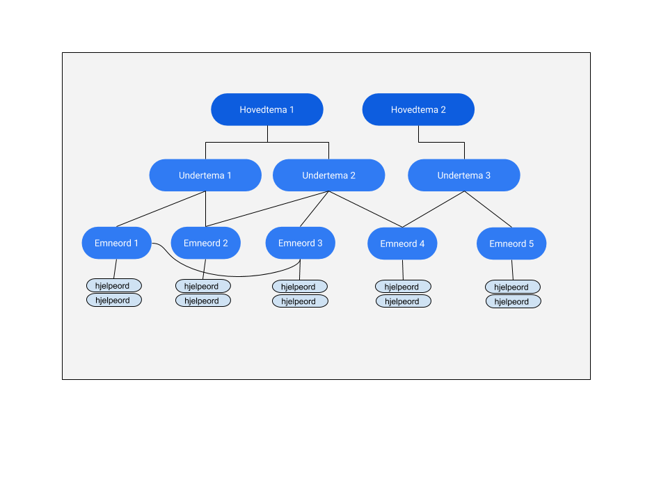

== Om Los

Los er et felles vokabular som er temainndelt for å kategorisere og beskrive offentlige tjenester og ressurser.

Vokabularet kan benyttes til en rekke formål, for eksempel:

* kategorisere og beskrive offentlige sluttbrukertjenester og ressurser (som for eksempel datasett, API-er og informasjonsmodeller)
* optimalisere søk på nettsider (ved hjelp av flerspråklighet, hjelpeord og synonymer).
* som parallellkorpus (bokmål, nynorsk og engelsk) for oversettingstjenester og maskinlæring
* kategorisere offentlige tjenester og ressurser på tvers av landegrenser (tilrettelegging for EUs Single Digital Gateway)

Vokabularet er tilrettelagt for bruk i lenkede data-miljøer og er gjort tilgjengelig som en nedlastbar RDF/XML-fil i tråd med SKOS-standarden. I tillegg er det laget en tjeneste som viser innholdet på en nettside og som gjør det mulig å gjøre enkeltoppslag mot hver enkelt term i vokabularet (URI-ene gir svar).

NOTE: Versjon 3.0  av Los er ute på høring. Gå til http://psi.norge.no/los/3/struktur.html[HTML-visning av Los 3.0 RC]
eller http://psi.norge.no/los/3/all.rdf[last ned Los 3.0 RC her] (RDF/XML). Mer informasjon om høringen finner du på https://los.difi.no[Los.difi.no]

== Bruksområder
Det er flere måter å bruke Los-vokabularet på. Den mest nærliggende er å referere til URIer for begrepene når en skal klassifisere en ressurs i et lenkede data-miljø. http://doc.difi.no/dcat-ap-no[Standard for beskrivelse av datasett og datakataloger] er et eksempel på bruksområder der Los skal brukes primært som referanse til tema ved hjelp av URIer.

Los kan også lastes ned lokalt og brukes som struktur for for eksempel offentlige nettsider. Dersom informasjonen som ligger i RDF/XML-filen blir tatt med i kildekoden for sidene, vil dette bidra til økt søkbarhet ettersom Los tilbyr beskrivelse på flere språk og målformer samt hjelpeord.

Merk at oversettelser til andre målformer og språk ikke er komplett, og at det er mulig å bidra til flere oversettelser direkte i vokabularets kildekode på Github.

== Struktur
De tre nivåene i Los er definert ved hjelp av hierarkiske relasjoner (skos:narrower og skos:broader). Hvert undertema (nivå 2) hører til kun ett hovedtema (nivå 1). Emneordene (nivå 3) kan ha relasjoner til flere undertemaer og kan dermed oppstå i flere kontekster (med samme identifikator). I tillegg til hierarkiske relasjoner forekommer det også noen assosiative relasjoner mellom emneord (skos:related).

Det øverste nivået i temastrukturen har termer som ”Arbeid”, “Familie og barn”, "Bygg og eiendom”, osv.

=== Hovedtema
Det øverste nivået av navigasjonsstrukturen angir hovedtemaene. Følgende 15 hovedtemaer er definert i Los 3.0:

* Arbeid
* Bygg og eiendom
* Demokrati og innbyggerrettigheter
* Familie og barn
* Helse og omsorg
* Innvandring og integrering
* Kultur, idrett og fritid
* Lov og rett
* Næring
* Natur, klima og miljø
* Samfunnssikkerhet og beredskap
* Skatt og avgift
* Skole og utdanning
* Sosiale tjenester
* Trafikk og transport

=== Undertema
Undertemaene i Los er spesifiseringer av hovedtemaene. Et undertema er aldri knyttet til mer enn en ett hovedtema.

For eksempel har hovedtemaet "Bygg og eiendom" følgende undertemaer:

* Bygging
* Eiendom
* Flytting
* Kjøp og salg
* Kommunale planer
* Leie og utleie
* Priser og gebyr for bygg og eiendom

=== Emneord

Los inneholder over 430 emneord som er knyttet til ett eller flere undertemaer. Emneordene har (med noen unntak - work in progress) beskrivelser på minst ett språk. I tillegg til å være knyttet til ett (eller flere) undertema (og implisitt også ett eller flere hovedtema), kan emneordene ha hjelpeord (skos:hiddenLabel) knyttet til seg.

For eksempel har emneordet "Yrkesskadedekning" følgende beskrivelse på bokmål:

 Yrkesskade er en skade som skjer ved en ulykke i arbeidstiden. Yrkesskadedekningen gir særfordeler utover folketrygdens ordinære stønadssystem.

Emneordet har følgende anbefalte språkvarianter:

* Engelsk (en): Occupational injury coverage
* Bokmål (nb): Yrkesskadedekning
* Nynorsk (nn): Yrkesskadedekning

...og følgende hjelpeord på bokmål:

* Arbeidsulykke
* Skadeforklaring
* Yrkesrelatert helseplage
* Yrkesskadeforsikring
* Yrkessykdom

Språkkode er angitt i tråd med ISO 639-1 for alle emneord, hjelpeord og definisjoner (en, nb, nn)

== Hjelpeord

Los inneholder over 1600  hjelpeord i form av synonymer, utgåtte termer og spesifiseringer. Disse er knyttet til emneordene som _skos:hiddenLabel_ og har ikke egne URIer

== Forvaltning
Los blir utgitt og forvaltet av Digitaliseringsdirektoratet. En egen arbeidsgruppe vurderer behovet for ny versjon basert på tilbakemeldinger hver 3. måned. Revisjonsyklysen skal vurderes på nytt i januar 2021, men minimum en gang i året. Bidrag i form av forslag til oversettelser av termer og definisjoner blir vurdert fortløpende. Utvidelser og tillegg blir ikke varslet utover oppdatering av endringsloggen.  Alle endringer vil derfor være basert på tilbakemeldinger og innmeldte behov.

Digitaliseringsdirektoratet benytter Github til versjonering og forvaltning, og forslag til endringer kan forslås (som “issue”) https://github.com/difi/los/issues/new?assignees=&labels=H%C3%B8ringssvar&template=h-ringssvar-og-tilbakemeldinger.md&title=[direkte på Github], eller via epost til  mailto:informasjonsforvaltning@digdir.no[informasjonsforvaltning@digdir.no].

== Kriterier for utvidelse
Forslag til utvidelser av vokabularet vil bli vurdert ut fra følgende kriterier:

 * Termene i Los skal være brukerorienterte - ikke avsenderorienterte
 * Termene i Los skal være tjenesteorienterte - ikke orientert rundt for eksempel livssituasjon eller funksjonsområde
 * Termene i Los skal fungere best mulig på tvers av forvaltningsnivåer og fagområder

== Varighets og versjons-policy

Versjonering skjer i samsvar med https://semver.org/[Semver-standarder] etter følgende prinsipper:

 * Oppdaterte beskrivelser av emneord, og oversettelser til flere språk, mapping til andre vokabular og øvrige endringer som ikke påvirker struktur eller identifikatorer, kategoriseres som "PATCH" (3.0.*X*). Endringene av denne typen blir dokumentert i endringsloggen, men ikke behandlet av arbeidsgruppen.
 * Endringer i form av nye emneord og/eller nye tema kategoriseres som "MINOR" (3.*X*.0). Utgåtte termer og innhold som fjernes vil bli varslet i endringsloggen og i selve rdf-koden (som skos:note) i minimum 3 måndeder før innholdet blir tatt bort.
 * Endringer i API-et som ikke er bakoverkompatible og større strukturelle endringer som medfører at et større antal URI-er ikke lenger gir svar, kategoriseres som "MAJOR" (*X*.0.0)

Selve tjenesten (URI-ene som gir svar i rdf/xml) har kontordrift, og Difi gir ingen garantier for oppetid.

== Vilkår for bruk

Los kan brukes fritt av alle uansett formål. Los  er gjort tilgjengelig under  lisensen https://creativecommons.org/publicdomain/zero/1.0/deed.no[Creative Commons Zero (CC0 1.0)]. Dette innebærer at Digitaliseringsdirektoratet sier fra seg alle de opphavsrettigheter og nærstående rettigheter til verket og at alle kan kopiere, endre, distribuere Los uten å spørre om tillatelse. Vi ber om at nye produkter basert på Los får en navngivning som gjør det lett for brukerne å skille Los fra avledede produkter.

== Retningslinjer for videreutvikling av Los

=== Brukeren i sentrum
Hovedregelen for valg av begreper og struktur er _brukeren i sentrum_, forstått som innbyggernes behov for å finne fram til offentlige tjenester og informasjon på tvers av virksomheter og forvaltningsnivåer. Termene i Los skal primært beskrive tjenester og informasjon om forbud, påbud, tilbud, rettigheter og plikter rettet mot innbyggerne. I fremtidige versjoner skal det vurderes å utvide omfanget til øvrige forvaltningsaktiviteter og tjenester levert av næringsliv og sivilsamfunn.

=== Bruk allmenne tema
Termene på nivå 1 og 2 (tema og undertema)  skal være så allment forståelig som mulig, og bør ikke si noe om organiseringen av tjenesten. Hovedfokus er temainndeling av offentlige tjenester.

=== Bruk spesifikke emneord
Selv om emneord kan knyttes til  flere undertema, så er hovedregelen at du bør være spesifikk når nye emneord legges til. Et emneord som _Tilsyn_ er relevant for en hel rekke tema (for eksempel _Barnehage_, _Skole_, _Landbruk_ og _Arbeidsliv_. Dersom emneordet har relevans for flere enn to tema, er det en indikasjon på at du bør være mer spesifikk (for eksempel ved å velge termer som _Tilsyn og godkjenning av barnehager_). Bruk skjønn og tenk på brukerne.

=== Berik emneordene med hjelpeord
Los bruker hjelpeord (skos:hiddenLabels) for å hjelpe brukeren til rett tjeneste. Hjelpeord kan være skjulte for brukerne, men samtidig bli brukt av søkemotorer når brukerne søker etter ord som ikke er en del av det synlige vokabularet. Hjelpeord kan være mer spesifikke termer synonymer, nært beslektede termer, verbformer av substantiver, utgåtte ord eller ord som er brukt i dagligtale. Hjelpeord kan også være spesifiseringer av emneordet. For eksempel er følgende bokmåls-hjelpeord knyttet til emneordet "Ruteinformasjon":

_Bussrute, Busstider, Båtrute, Fergerute, Fergetider, Ferjerute, Ferjetider, Forsinkelser, Kanselleringer, Køreplaner, Ruteopplysning, Rutetabell, Rutetider, Rutetider, Sporveisrute, T-banerute, Togrute, Togtider, Trikkerute_

=== Husk samsvar mellom emneord og beskrivelse
Et emneord kan potensielt brukes i flere kontekster. Du må derfor se til at det er samsvar mellom selve termen og den tilhørende beskrivelsen. Eksempel: _Tilsyn_ kan ikke defineres som _"Kommunen fører tilsyn med private og kommunale barnehager"_ ettersom denne beskrivelsen ekskluderer andre typer tilsyn. Her må enten selve ordet gjøre med spesifikt (_Tilsyn og godkjenning av barnehager_) eller beskrivelsen må gjøres mer allmenn.

=== Bruk substantivformer
Ved utforming av nye tema, undertema og emneord skal du bruke ubestemt form av substantiv. Hovedregelen er entall, men flertallsformen brukes der det er naturlig (som når et tema inneholder ulike typer tjenester).

=== Vær flerspråklig
Los er på bokmål, nynorsk og engelsk. Nye tema, undertema, emneord, skjulte søkeord og beskrivelser skal legges til i alle tre språkformer (med språkkodene “nn”, “nb” og “en”). Forslag til nye tema, undertema og emneord bør foreligge på alle tre språkformer slik at de er raske å implementere. Beskrivelsene må foreligge på minst en norsk språkform.

=== Legg til rette for åpenhet og sporbarhet
Alle kan foreslå endringer og melde inn behov. Primært skal dette skje via “Github Issues” eventuelt på epost til informasjonsforvaltning@digdir.no. Endringsforslag vil bli samlet opp og vurdert av arbeidsgruppen i tråd med gjeldene revisjonssyklus. Github brukes til å samle og struktrere behov samt spore alle endringer i vokabularet.

== Los uttrykt i SKOS
Los er publisert i RDF/XML som et SKOS-vokabular. SKOS er en W3C-anbefaling utviklet for å representere thesaurier, klassifikasjonssystemer, taksonomier og kontrollerte vokabular. SKOS er del av en rekke standarder for den semantiske webben som bygger på RDF og RDFS. Hovedformålet med SKOS er å tilby en enkel publisering og bruk av vokabular som lenkede data.

Hver term har en stabil og globalt unik http-URI. URIene er bygd opp med følgende struktur: https://psi.norge.no/los/tema/{term}. URIen for termen “arbeid” blir dermed https://psi.norge.no/los/tema/arbeid[https://psi.norge.no/los/tema/arbeid] og denne gir da svar i rdf-format. En html-visning av termen oppnås ved å legge til .html som suffiks. Lenke til html-representasjon av samme term blir dermed https://psi.norge.no/los/tema/arbeid.html[https://psi.norge.no/los/tema/arbeid.html]

Omskrivningsreglene i selve URIene for særnorske tegn og mellomrom er: +
æ -> a +
ø -> o +
å -> a +
(mellomrom) -> - +
Eksempel:  https://psi.norge.no/los/tema/natur-og-miljo[https://psi.norge.no/los/tema/natur-og-miljo]

I Los er både hovedtemaer, undertemaer og emneord  _SKOS concept_. Disse står i relasjoner til hverandre i et hierarki. Nivå 1 og 2 er et rent hierarki, mens nivå 3 kan være relateres til flere termer på nivå 2. I tillegg har noen emneord assosiative relasjoner seg imellom (skos:related).

Eksempel på undertemet “arbeidsliv” uttrykt i SKOS:

[cols="1,2", options="header"]
|===
| Hva som beskrives: | Hvordan dette er uttrykt i SKOS:

|Referanse til rdf-skjemaet for gjeldende vokabular|`<skos:inScheme rdf:resource="https://psi.norge.no/los/ontologi/tema/>`
|Emneordets foretrukne skrivemåte på nynorsk|`<skos:prefLabel xml:lang="nn">Arbeidsliv</skos:prefLabel>`
|Emneordets foretrukne skrivemåte på bokmål|`<skos:prefLabel xml:lang="nb">Arbeidsliv</skos:prefLabel>`
|Emneordets foretrukne skrivemåte på engelsk|`<skos:prefLabel xml:lang="en">Employment</skos:prefLabel>`
|Referanse til relatert begrep med mer avgrenset betydning (altså et emneord):|`<skos:narrower rdf:resource="https://psi.norge.no/los/ord/sykefravar/>`
|Referanse til begrep med bredere betydning (altså undertemaets hovedtema eller emneordets undertema)|`<skos:broader rdf:resource="https://psi.norge.no/los/tema/arbeid/>`
|===

Videre er emneordet “sykefravær” uttrykt slik i SKOS (denne gangen et eksempel i fullstendig RDF):

[source,xml]
----
<rdf:RDF xmlns:rdf="http://www.w3.org/1999/02/22-rdf-syntax-ns#"
         xmlns:skos="http://www.w3.org/2004/02/skos/core#">
  <rdf:Description rdf:about="https://psi.norge.no/los/ord/sykefravar">
    <rdf:type rdf:resource="http://www.w3.org/2004/02/skos/core#Concept"/>
    <skos:inScheme rdf:resource="https://psi.norge.no/los/ontologi/ord"/>
    <skos:prefLabel lang="en">Sick leave</skos:prefLabel>
    <skos:prefLabel lang="nn">Sjukefråver</skos:prefLabel>
    <skos:prefLabel lang="nb">Sykefravær</skos:prefLabel>
    <skos:hiddenLabel lang="nb">Egenmelding</skos:hiddenLabel>
    <skos:hiddenLabel lang="nn">Eigenmelding</skos:hiddenLabel>
    <skos:hiddenLabel lang="nn">Sjukemelding</skos:hiddenLabel>
    <skos:hiddenLabel lang="nn">Sjukmelding</skos:hiddenLabel>
    <skos:hiddenLabel lang="nb">Sykemelding</skos:hiddenLabel>
    <skos:hiddenLabel lang="nb">Sykmelding</skos:hiddenLabel>
    <skos:definition lang="nn">Sjukefråver er fråver frå lønna arbeid på grunn av sjukdom.</skos:definition>
    <skos:definition lang="nb">Sykefravær er fravær fra lønnet arbeid på grunn av sykdom.</skos:definition>
    <skos:related rdf:resource="https://psi.norge.no/los/ord/sykepenger"/>
    <skos:broader rdf:resource="https://psi.norge.no/los/tema/arbeidsliv"/>
  </rdf:Description>
</rdf:RDF>
----

== Bidra til Los
Innmelding av behov og løsningsforslag skjer primært https://github.com/difi/los/[via prosjektets Github-side] (krever Github-bruker), men kan også sendes på epost til mailto:informasjonsforvaltning@digdir.no[informasjonsforvaltning@digdir.no].

== Lenker

* http://psi.norge.no/los/struktur.html[Temastruktur]
* Listevisning hele Los:  http://psi.norge.no/los/view/table-nn[nynorsk ]| http://psi.norge.no/los/view/table-nb[bokmål ]| http://psi.norge.no/los/3/view/table-en[engelsk]|
* Listevisning “Kommune-Los”: http://psi.norge.no/los/view/table-nn/samling/kommune-los[nynorsk] | http://psi.norge.no/los/3/view/table-nb/samling/kommune-los[bokmål] | http://psi.norge.no/los/3/view/table-en/samling/kommune-los[engelsk] |
* http://psi.norge.no/los/samling/kommune-los/all.rdf[Last ned "Kommune-Los" (RDF/XML)]
* http://psi.norge.no/los/all.rdf[Last ned komplett datasett (RDF/XML)]
* https://github.com/difi/los/issues/new?assignees=&labels=H%C3%B8ringssvar&template=h-ringssvar-og-tilbakemeldinger.md&title=[Gi tilbakemeldinger på Github] (krever bruker og innlogging)
* https://github.com/difi/los/issues[Oversikt over tilbakemeldinger og innmeldte behov]
